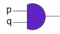
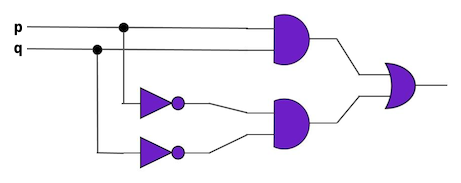

# Homework 1, K-State CIS 301, Fall 2017

* **Deadline:** Wednesday, September 6, 2017, 11:59pm US Central 

* **Total Points:** 20 (**+ 4 bonus points**)

## Assignment Purpose 

- Learn the syntax of propositional logic formulas

- Determine the meaning (determine the truth value) of a 
  propositional logic formula using truth tables

- Understand the correspondence between proposition logic
  formulas and circuits

## More Conventions

* For all the problems below, we use small letters ``p``, ``q``, 
  ``r``, and ``s`` to represent propositional claims.
  In your solutions, please use small letters and preserve
  the letter ordering.
  That is, in a truth table, we assume alphabetical ordering on 
  the inputs, e.g., ``q`` after ``p``) and no substitutions
  (e.g., replacing ``p`` with ``q``, and vice versa).
  For gates with two inputs such as the *and* gate below:

  

  The first input should be written on the left-hand side and
  the second input should be written on the right-hand side,
  i.e., ``p ∧ q`` instead of ``q ∧ p`` even though *and* is
  [commutative](https://en.wikipedia.org/wiki/Commutative_property).
  Any deviation of the above conventions results in point deductions.

* On the other hand, you can use either the ASCII or the Unicode
  symbols for the operators *and* (``∧``, or ``^``), 
  *inclusive-or* (``∨``, or ``V``), *negation* (``¬``, or ``~``),
  and *implication* (``→``, or ``->``); the
  Logika IntelliJ (LIVE) plugin features
  [Key Shortcuts](http://logika.sireum.org/doc/02-live/index.html#shortcuts)
  for inserting Logika Unicode operators.
  Note that if you use Unicode, it is best to use 
  [fixed-width font (even for Unicode characters)](http://logika.sireum.org/doc/02-live/index.html#using-a-fixed-width-font)
  when editing your solutions. 
  
* For truth table files, **DO NOT** uses tabs.

* Sireum IVE/IntelliJ has a nice vertical text block selection mode that you can
  leverage to copy text columns:
  
  https://www.jetbrains.com/help/idea/selecting-text-in-the-editor.html#column_selection

The above conventions are applicable for subsequent assignments. 

## Problem Descriptions

1. [2 points]
   In the lecture regarding implication, 
   we discussed that from ``p → q`` and ``p``, we should be able to get ``q``. 
   This claim can be expressed as: 
   
   ``(p → q) ∧ p → q``
   
   Build a (Logika) truth table to demonstrate that the claim is "good". 

2. [2 points]
   To show the importance of parentheses and their effect on evaluation
   (in comparison to #1), build the truth table for:  
   
   ``(p → q ∧ p) → q``
   
3. [4 points]
   Create a truth table for the following circuit  
      

4. [5 points]
   One of the logical inference rule that we will be learning in the coming lecture
   can be expressed as follows:
   
   ``(p ∨ q) ∧ (p → r) ∧ (q → r) → r``
   
   Build a truth table for it.
   
5. [7 points]
   By now, you have seen truth tables with up to three input
   variables; to further
   [grok](https://en.wikipedia.org/wiki/Grok#In_computer_programmer_culture)
   the scaling behavior in complexity with reasoning about formula
   with larger inputs, give a Logika truth table for the following
   proposition with four input variables:
   
   ``¬(p ∨ s) ∧ (q ∨ ¬r) → r → q``.
   
### Bonus Problem 
     
6. [4 points]
   Give a truth table that is a contradiction involving 3 inputs.
   
   Note that no partial credit will be given for bonus homework problems.
